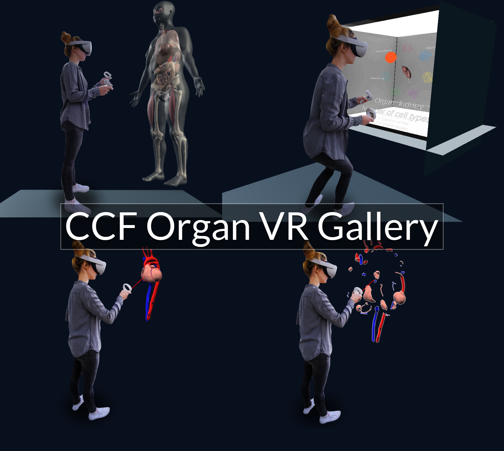

# HRA Organ Gallery

Welcome to this repo! The HRA Organ Gallery lets the user explore 55 human organs, journeying from the whole body, to the organ, to the tissue block, presented in real-world size and 3D. The organ models were developed to map trillions of cells for the [Human BioMolecular Atlas Program (HuBMAP)](https://commonfund.nih.gov/hubmap). 

For more information about the Common Coordinate Framework (CCF) used to map tissue blocks from 100s of donors to single reference organs, see the HuBMAP CCF Portal at [https://hubmapconsortium.github.io/ccf/](https://hubmapconsortium.github.io/ccf/).

## Video demo

We present the HRA Organ Gallery v0.5 in this demo: [https://www.youtube.com/watch?v=S9pBOlSfsnc](https://www.youtube.com/watch?v=S9pBOlSfsnc)

## Changelog

See the [Changelog](CHANGELOG.md) for the latest developments.

## Credits

This software is developed by [Andreas Bueckle](https://www.andreas-bueckle.com) and the Red Pill Blue Pill team at the [Cyberinfrastructure for Network Science Center at Indiana University](http://cns.iu.edu/). 

## Become a test user

If you would like to become a **test user**, please email Andreas Bueckle at [abueckle@iu.edu](mailto:abueckle@iu.edu).

## Data 

K. Browne et al. "HuBMAP CCF 3D Reference Object Library." [https://hubmapconsortium.github.io/ccf/pages/ccf-3d-reference-library.html](https://hubmapconsortium.github.io/ccf/pages/ccf-3d-reference-library.html) (accessed Jan 7, 2022).

Anatomical data from the National Library of Medicine’s Visible Human Project. [https://www.nlm.nih.gov/databases/download/vhp.html](https://www.nlm.nih.gov/databases/download/vhp.html) 

V. Spitzer, M. J. Ackerman, A. L. Scherzinger, and D. Whitlock, "The visible human male: a technical report," (in eng), Journal of the American Medical Informatics Association, vol. 3, no. 2, pp. 118-130, Mar-Apr 1996, doi: 10.1136/jamia.1996.96236280.

## VHMOOC

To access all Visible Human Massive Open Online (VHMOOC) materials, register for free at [https://expand.iu.edu/browse/sice/cns/courses/hubmap-visible-human-mooc](https://expand.iu.edu/browse/sice/cns/courses/hubmap-visible-human-mooc).

## References

K. Börner, A. Bueckle, et al., “Tissue Registration and Exploration User Interfaces in support of a Human Reference Atlas,” Nature Communications Biology, 2022. doi: 10.1038/s42003-022-03644-x

K. Börner et al., "Anatomical structures, cell types and biomarkers of the Human Reference Atlas," Nature Cell Biology, vol. 23, no. 11, pp. 1117-1128, 2021/11/01 2021, doi: 10.1038/s41556-021-00788-6.

M. P. Snyder et al., "The human body at cellular resolution: the NIH Human Biomolecular Atlas Program," Nature, vol. 574, no. 7777, pp. 187-192, 2019/10/01 2019, doi: 10.1038/s41586-019-1629-x

## Other software credits

Cyberinfrastructure for Network Science Center. "Registration User Interface." [https://hubmapconsortium.github.io/ccf-ui/rui/](https://hubmapconsortium.github.io/ccf-ui/rui/) (accessed Jan 11, 2023).

Cyberinfrastructure for Network Science Center. "Exploration User Interface." [https://portal.hubmapconsortium.org/ccf-eui](https://portal.hubmapconsortium.org/ccf-eui)  (accessed Jan 11, 2023).

